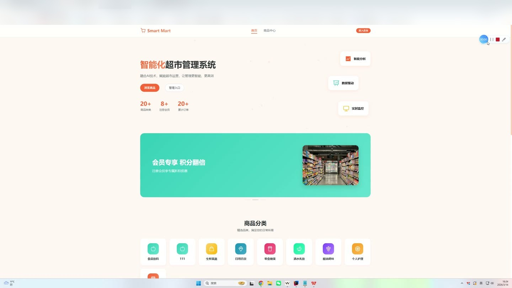
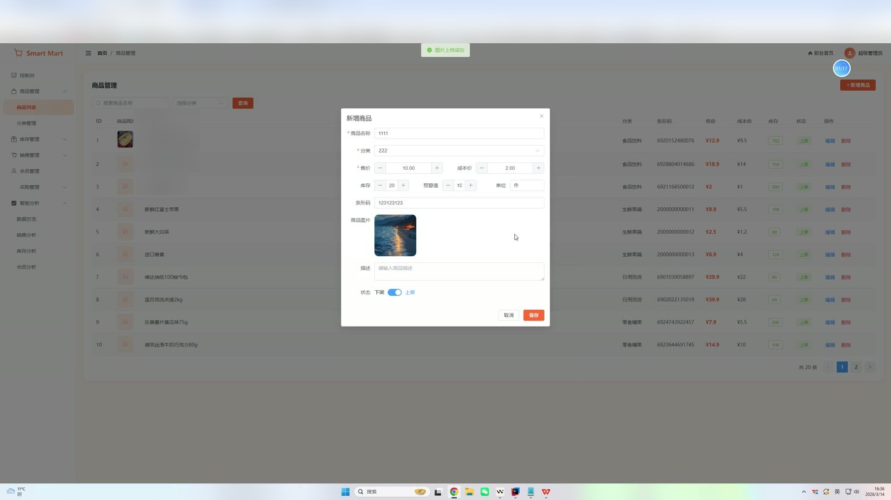
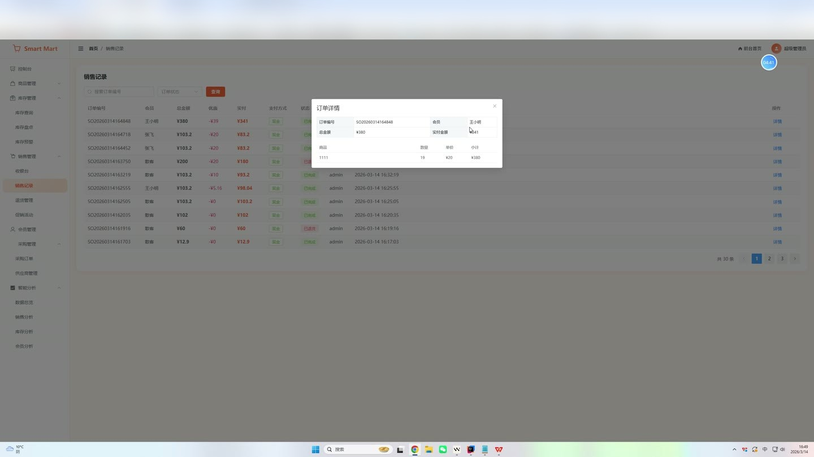
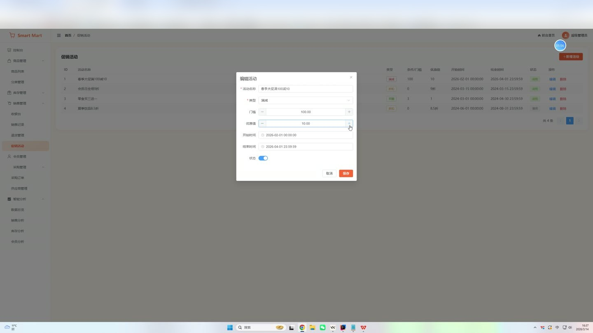
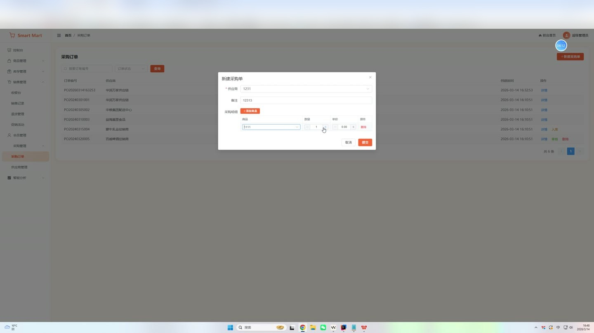
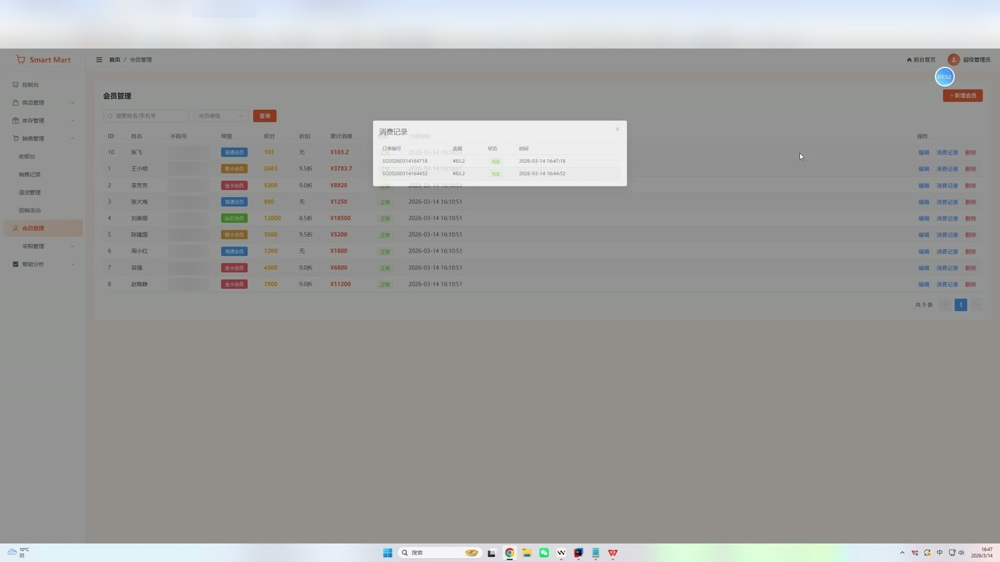

# (附文档)Springboot3+Vue3+MySQL 智能化超市管理系统

**技术栈**：Springboot3、Vue3、MySQL

### 系统简介

智能化超市管理系统采用 Spring Boot 3 + Vue 3 前后端分离架构，提供从收银销售、会员管理、库存监控到采购供应链的全链路数字化管理。系统内置管理员端与前台展示端，支持收银台快速开单、会员积分折扣、促销活动满减/折扣、库存预警与智能补货建议、采购订单审批入库、多维度数据可视化分析等核心业务场景。
 
### 核心功能
 
### 管理员端

 
- 收银台：选择商品（支持按名称/条码搜索）、设置数量、选择会员（自动计算会员折扣与积分）、选择支付方式、提交生成销售订单，自动扣减库存 
- 销售记录：查看销售订单列表（支持按订单号/状态筛选）、查看订单详情（含商品明细与会员信息）、执行退货操作（恢复库存并标记订单状态为已退货） 
- 退货管理：集中查看已退货订单，支持按条件筛选与详情查看 
- 商品管理：新增/编辑/删除商品（填写名称、分类、条码、售价、成本价、库存、预警值、单位、图片、描述、上下架状态）、按名称/分类/状态筛选商品列表 
- 分类管理：新增/编辑/删除商品分类（设置名称、图标、排序号、启用状态）、按名称筛选分类列表 
- 库存查询：查看所有商品的实时库存列表（含分类名）、支持按名称/分类/状态筛选 
- 库存盘点：新增盘点记录（选择商品、填写实际库存、备注），系统自动计算系统库存与差异量并更新商品库存 
- 库存预警：查看库存低于预警值的商品列表（含分类名），支持一键查看智能补货建议（建议采购量 = 预警值×3 - 当前库存） 
- 会员管理：新增/编辑/删除会员（填写姓名、手机号、积分、等级、折扣率、累计消费金额、状态）、按姓名/手机号/等级筛选、查看会员历史订单 
- 采购订单：新增采购订单（自动生成单号 PO+时间戳、选择供应商、添加商品明细含数量与单价、自动计算总金额）、查看订单列表（支持按单号/状态筛选）、审核订单（标记为已审核）、入库操作（增加商品库存并标记订单为已完成）、删除订单 
- 供应商管理：新增/编辑/删除供应商（填写名称、联系人、电话、地址、状态）、按名称筛选 
- 促销活动：新增/编辑/删除促销活动（设置活动名称、类型（满减/折扣）、满额门槛、优惠值、起止时间、状态）、查看进行中的活动列表 
- 控制台：展示商品总数、会员总数、订单总数、销售总额、库存预警数等关键指标卡片 
- 销售分析：月度销售额趋势图（柱状图）、热销商品 TOP10 排行（条形图）、支付方式分布统计 
- 库存分析：库存预警商品列表、智能补货建议列表、分类商品数量分布图（条形图） 
- 会员分析：会员等级分布饼图（普通/银卡/金卡/钻石）、会员消费排行 TOP10 
- 文件上传：支持上传商品图片等文件，返回可访问 URL
 
### 前台展示端

 
- 首页：展示热销商品列表（限 8 条）、进行中的促销活动列表 
- 商品商城：分页浏览在售商品（支持按分类筛选、按关键词搜索）、查看商品详情（含分类名、价格、库存、图片、描述） 
- 商品详情页：展示商品完整信息，支持查看所属分类 
- 促销活动展示：查看所有未过期的促销活动列表
 
### 技术栈

 后端框架Spring Boot 3.x ORM 框架MyBatis-Plus（含分页插件） 权限认证JWT（拦截器校验 token，排除登录与公开接口） 前端框架Vue 3（Composition API + setup 语法） 状态管理Pinia 前端路由Vue Router 4（路由守卫控制登录权限） UI 组件库Element Plus 数据可视化ECharts 构建工具Vite 数据库MySQL 8.x 数据库连接池Spring Boot 默认 HikariCP JSON 序列化Jackson（配置 LocalDateTime 格式化）
 
### 交付内容

 
- 后端完整源码 
- 前端完整源码 
- 数据库初始化脚本 
- 万字文档

## 界面展示

---

## 获取完整源码 + 万字文档

本仓库为项目介绍页。**完整前后端源码、数据库初始化脚本、万字项目文档**，请加微信 `kangkangcode`，或访问 [codekk.top](http://codekk.top) 获取。

可作课程设计 / 毕业设计参考，支持远程部署调试。